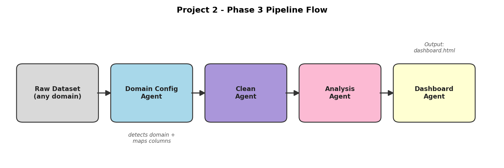
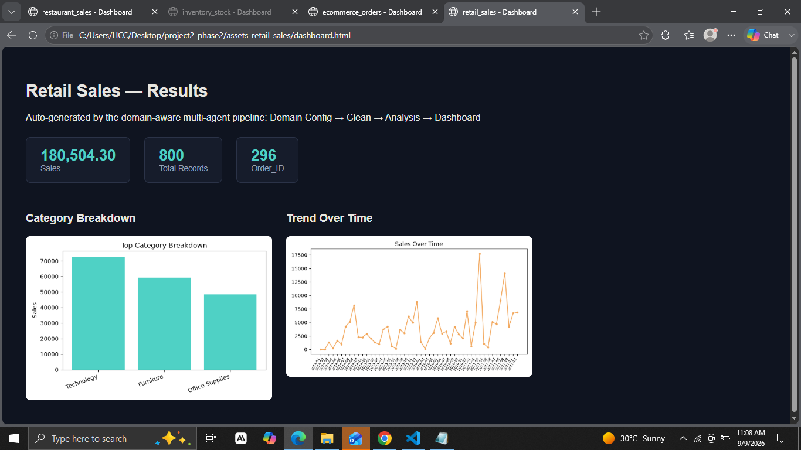
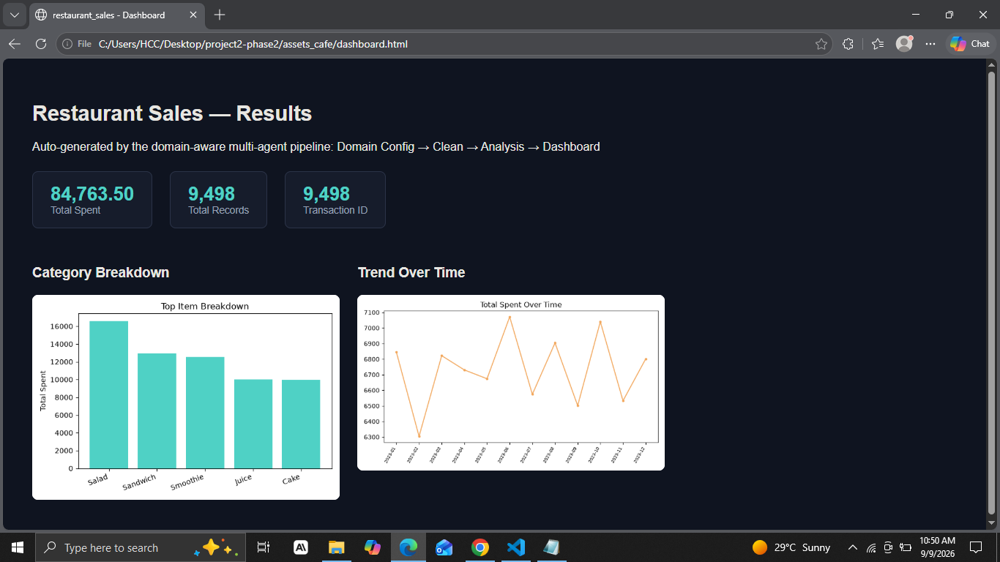
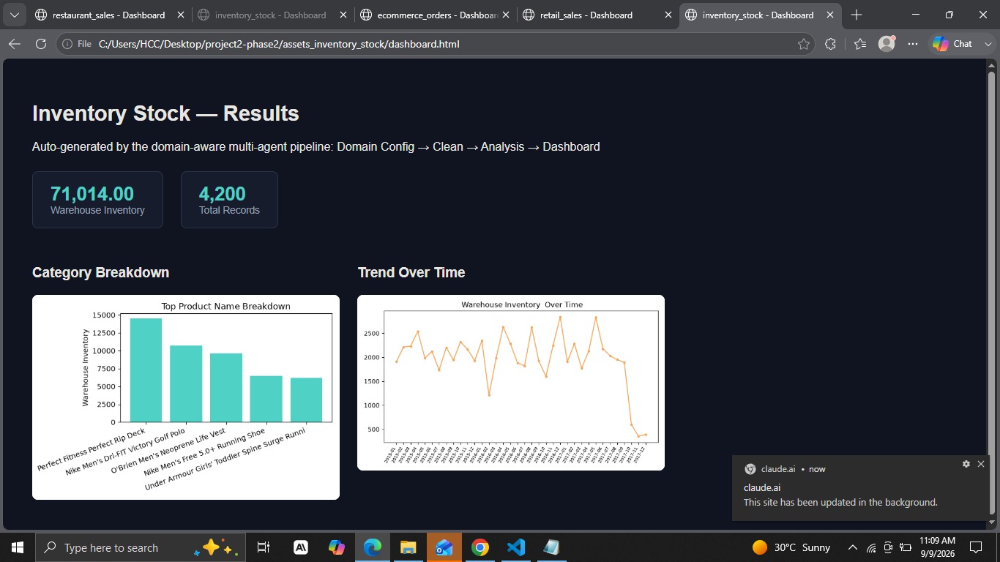
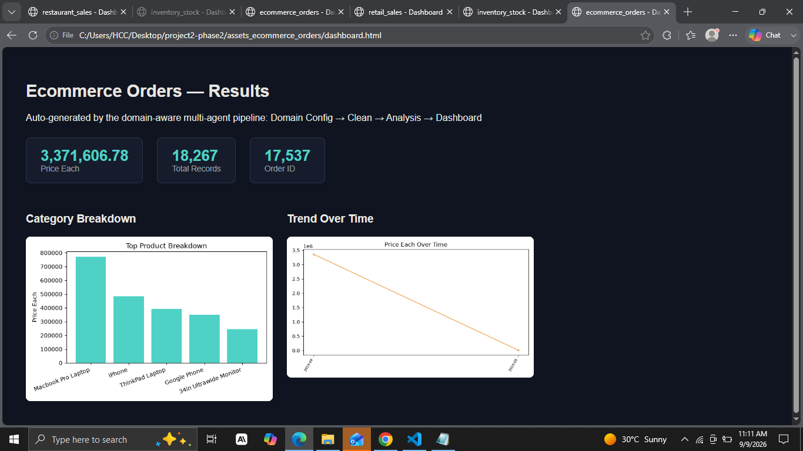

# Project 2 — Phase 3: Domain-Aware Multi-Agent Data Pipeline

A production-grade multi-agent system that takes **any** tabular business
dataset — retail sales, restaurant transactions, inventory stock, e-commerce
orders — and automatically detects what kind of data it's looking at, cleans
it, analyzes it, and builds a dashboard around it. No dataset-specific code.

Built with **Python, LangChain, LangGraph, and Groq (Llama-based LLM)**.

---

## Why this exists

Phase 2 proved a multi-agent pipeline could clean, analyze, and visualize one
dataset (a retail Superstore CSV). But it only worked because every agent had
that dataset's exact column names hardcoded in (`Sales`, `Region`,
`Product_Name`, etc.). Point it at a different dataset and it would either
crash or silently produce nothing useful.

Phase 3's job was to remove that hardcoding entirely, and prove it by testing
on datasets from **4 genuinely different domains.**

---

## Architecture

```
Raw Dataset  →  Domain Config Agent  →  Clean Agent  →  Analysis Agent  →  Dashboard Agent
 (any domain)      (detects domain +        (domain-        (domain-         (builds layout
                    maps columns)            aware)          aware)           from whatever
                                                                               data exists)
```



### Domain Configuration Agent *(new in Phase 3)*

This is the main addition this phase. It runs **before** anything else in the
pipeline. Given a raw dataset, it:

1. Inspects the dataset's columns, dtypes, and a small sample of rows
2. Uses an LLM (Groq / `openai/gpt-oss-120b`) to classify which business
   domain the data represents — retail sales, restaurant sales, inventory
   stock, e-commerce orders, subscription/SaaS, or "unknown" if genuinely
   ambiguous
3. Maps the dataset's *actual* column names to four generic roles:
   `date_col`, `value_col`, `category_col`, `id_col`
4. Proposes success metrics appropriate to that domain

Every other agent downstream reads from this config instead of assuming a
column is literally named `"Sales"` or `"Region"`. That's what makes the rest
of the pipeline reusable.

### Clean Agent *(rewritten this phase)*

Cleans whatever `value_col` / `category_col` the Domain Config Agent found:
coerces the value column to numeric, drops rows missing it, fills missing
category labels instead of dropping the row, drops fully-blank rows and
duplicates, and removes rows with a negative value where that's invalid for
the domain.

### Analysis Agent *(rewritten this phase)*

Computes total value, unique record count, top-5 category breakdown, and a
monthly trend — all driven by the domain config's column mapping rather than
hardcoded names. Every calculation is wrapped in its own `try/except` so one
failed metric (e.g. no valid dates) doesn't take down the whole analysis.

### Dashboard Agent *(rewritten this phase — now dynamic)*

Builds the dashboard's layout based on **what's actually present** in the
analysis output, not a fixed template:

- Stat cards for whichever scalar totals exist
- A bar chart *if* a category breakdown was computed
- A line chart *if* a time trend was computed
- A visible "notes" section if something couldn't be charted, instead of
  silently failing

### Orchestrator

Wires all four agents into a single LangGraph pipeline. One function call —
`run_pipeline("data/any_dataset.csv")` — runs the whole thing end to end and
saves the cleaned data, insights JSON, domain config JSON, and dashboard HTML.

---

## Results across 4 different-domain datasets

All four ran through the **exact same orchestrator command**, with zero code
changes between runs — only the detected domain config differed.

| Dataset | Detected Domain | Confidence | Key Columns Found |
|---|---|---|---|
| Superstore (retail) | `retail_sales` | 0.97 | Sales, Category, Order_Date, Order_ID |
| Dirty Cafe Sales | `restaurant_sales` | 0.92 | Total Spent, Item, Transaction Date, Transaction ID |
| Warehouse Inventory | `inventory_stock` | 0.92 | Warehouse Inventory, Product Name, Year Month, *(no ID column — correctly detected as absent)* |
| E-commerce Orders | `ecommerce_orders` | 0.96 | Price Each, Product, Order Date, Order ID |

### Dataset 1 — Retail Sales


### Dataset 2 — Restaurant Sales


### Dataset 3 — Inventory Stock


### Dataset 4 — E-commerce Orders


---

## Production-grade requirements — how they were met

- **Error handling**: Every numeric/date/grouping operation in the Analysis
  Agent is individually wrapped in `try/except`, so a failure in one metric
  (e.g. an unparseable date column) doesn't crash the pipeline — it's logged
  in the output's `errors` field and the rest of the analysis continues. The
  Domain Config Agent falls back to a safe `"unknown"` config if the LLM call
  fails for any reason (see `assets/prompt-evolution-log.md`, bug #1).
- **Consistent output structure**: regardless of domain, every dashboard
  follows the same layout — stat cards, then category chart, then trend
  chart, then any notes — even though the *content* of each section is
  entirely different per dataset.
- **Prompt/pipeline versioning**: see `assets/prompt-evolution-log.md` for a
  full history of real bugs found while testing across domains and how each
  was fixed.
- **Clean, documented code**: each agent file has a module-level docstring
  explaining what changed since Phase 2 and why, plus inline comments at
  every non-obvious decision point.

---

## How prompts evolved through testing

Full details in [`assets/prompt-evolution-log.md`](assets/prompt-evolution-log.md).
Short version — four real issues were found and fixed by testing on genuinely
different data instead of only the original Superstore dataset:

1. The Groq model originally used had been retired — swapped to a current model.
2. A numeric `YYYYMM`-style date column (in the inventory dataset) was being
   silently misparsed by pandas as a 1970 timestamp — added a heuristic to
   detect and correctly re-parse this format.
3. Pandas/numpy number types were breaking JSON export — fixed by casting all
   analysis output to plain Python types.
4. The Clean Agent's hardcoded Superstore column names were replaced with
   domain-config-driven column lookups so it works on any dataset shape.

---

## Repo structure

```
project2-phase3/
├── agents/               # domain-config, clean, analysis, dashboard agents + orchestrator
├── test-datasets/        # the 4 datasets used for testing
├── assets/
│   ├── flow-diagram.png
│   ├── dataset1-result.png ... dataset4-result.png
│   ├── prompt-evolution-log.md
│   └── dataset*-*/       # full dashboard HTML + chart images per dataset
└── README.md
```

## Running it

```bash
pip install -r requirements.txt   # pandas, langchain-groq, langgraph, matplotlib
export GROQ_API_KEY=your_key_here
python -m agents.orchestrator test-datasets/superstore.csv
```

Swap the CSV path for any of the other test datasets (or a new one entirely)
— no code changes required.
